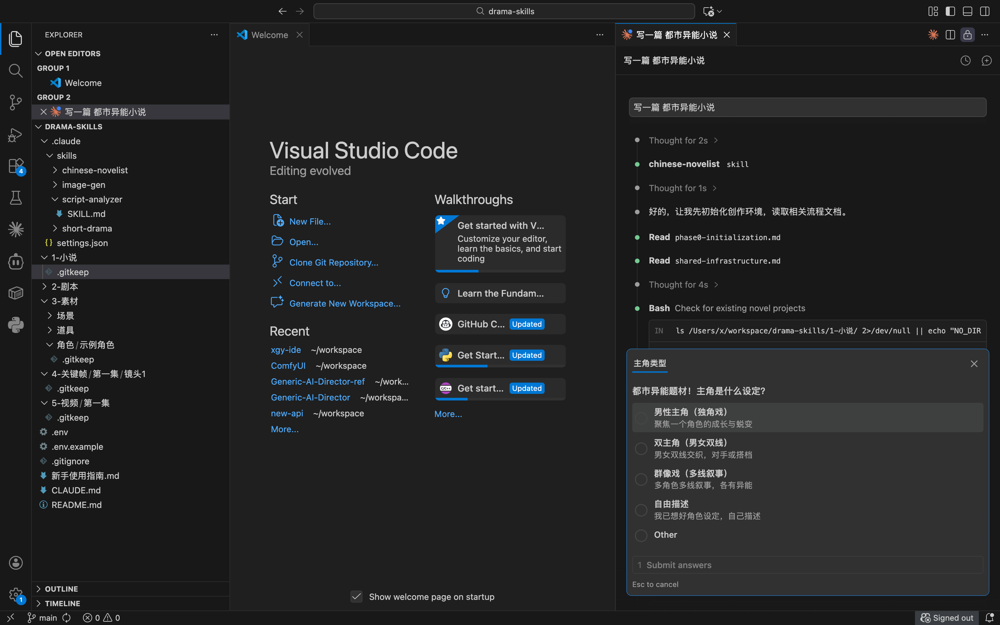
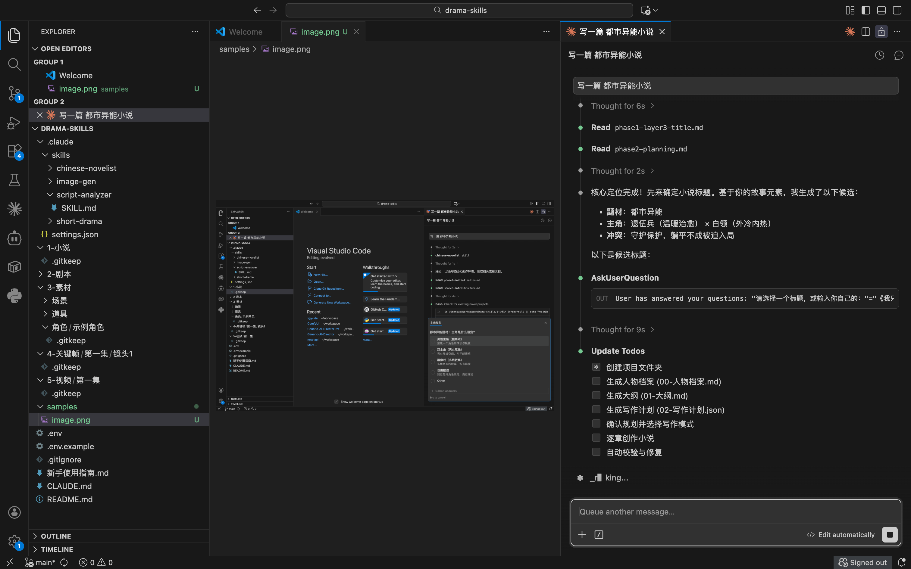
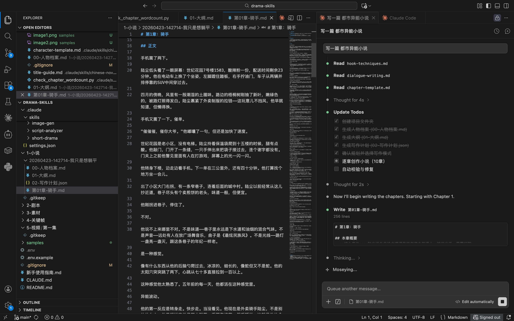
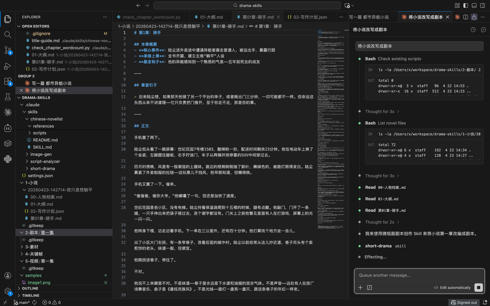
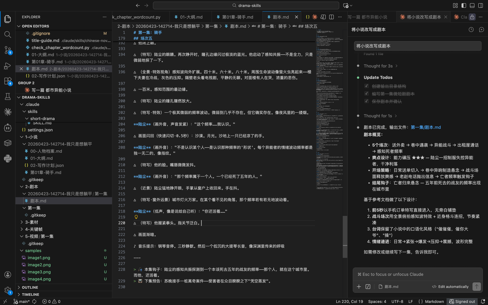
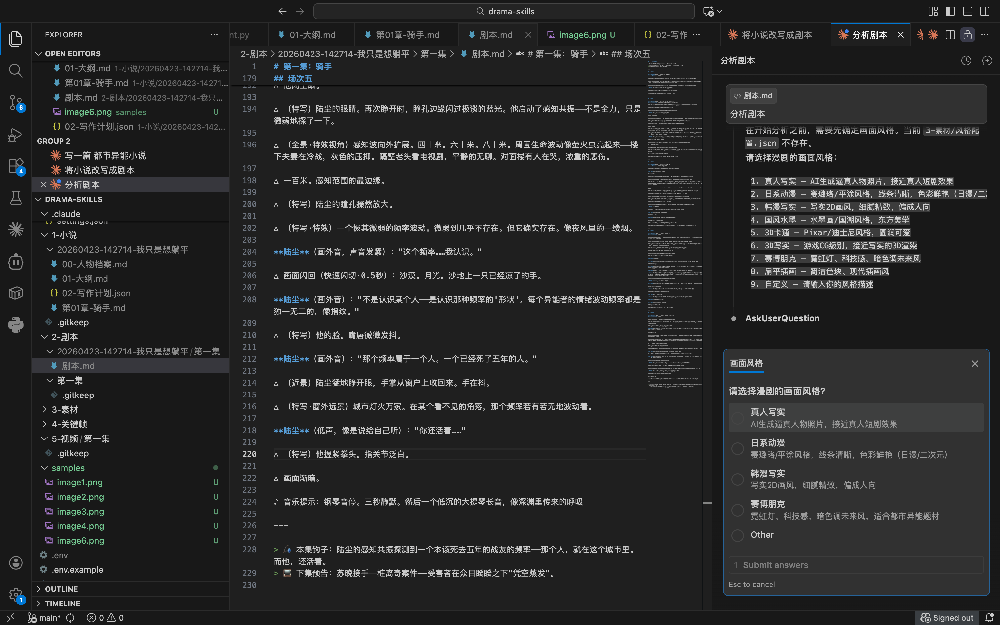
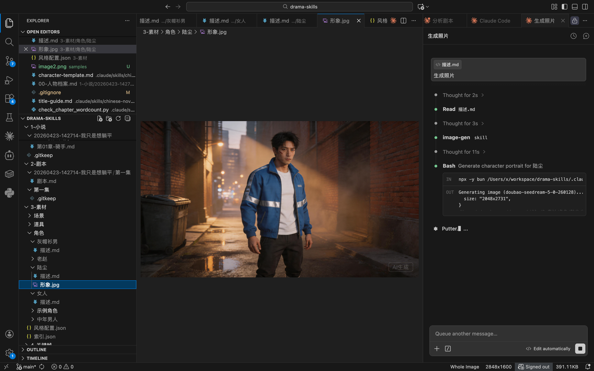
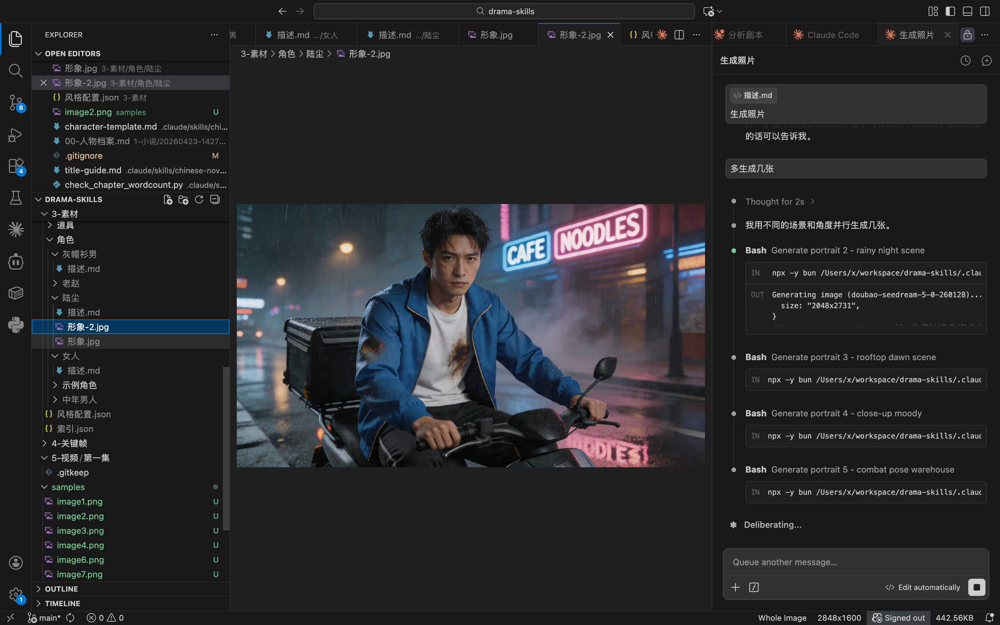

# AI 漫剧制作骨架项目

基于 Claude Code 的 AI 漫剧制作流水线骨架。将小说通过五个阶段转化为动画短剧。

## 流水线

```
小说 → 剧本 → 素材 → 关键帧 → 视频
```

| 阶段 | 目录 | 说明 |
|------|------|------|
| 小说 | `1-小说/` | 原文小说，按章节存放的 markdown |
| 剧本 | `2-剧本/` | 场景拆分、对白、镜头描述、AI 图片提示词 |
| 素材 | `3-素材/` | AI 生成的角色设计、场景、道具，附带元数据 |
| 关键帧 | `4-关键帧/` | 按场景合成的关键帧定义（JSON） |
| 视频 | `5-视频/` | 最终合成的视频输出 |

## 快速开始

### 前置条件

- [Claude Code](https://claude.ai/code)（CLI 或 VS Code 插件）
- 有效的 API Key

### 安装

```bash
git clone <repo-url>
cd drama-skills
cp .env.example .env
# 编辑 .env，填入你的 API Key
```

### 使用

在 VS Code 中打开项目，启动 Claude Code，直接对话即可驱动流水线：

1. 放入小说章节到 `1-小说/`
2. 让 Claude 生成剧本 → `2-剧本/`
3. 让 Claude 生成素材描述 → `3-素材/`
4. 让 Claude 合成关键帧 → `4-关键帧/`
5. 让 Claude 输出视频方案 → `5-视频/`

## 目录结构

```
1-小说/          # 小说原文 (markdown)
2-剧本/          # 改剧剧本 (markdown + 提示词)
3-素材/          # AI 生成素材
  角色/          #   角色设定与形象
  场景/          #   场景背景
  道具/          #   物件道具
  索引.json      #   素材注册表
4-关键帧/        # 关键帧定义 (JSON)
5-视频/          # 最终视频输出
```

## 预装 Skills

项目在 `.claude/skills/` 下预装了 4 个 Skill，覆盖流水线的关键阶段。在 Claude Code 中通过 `/skill名` 或自然语言触发：

| Skill | 触发方式 | 对应阶段 | 功能 |
|-------|---------|---------|------|
| **chinese-novelist** | `/chinese-novelist` | `1-小说/` | 分章节创作中文小说。通过递进式问答收集需求，自动生成大纲、人物档案，支持串行/并行写作，每章 3000-5000 字，结尾设悬念钩子 |
| **short-drama** | `/short-drama` → `/start` `/plan` `/episode` 等 | `2-剧本/` | 微短剧剧本创作。从选题定位到分集剧本，支持国内/出海双模式，内置 13 种题材、付费卡点设计、节奏曲线、合规审核 |
| **script-analyzer** | `/script-analyzer` → `/analyze characters` `/analyze scenes` `/analyze props` | `2-剧本/` → `3-素材/` | 桥接剧本与素材阶段。从剧本中提取角色、场景、道具，生成定妆照描述和 AI 提示词，自动创建素材目录和索引 |
| **image-gen** | `/image-gen` | `3-素材/` | AI 图片生成。调用 Doubao Seedream API，支持文生图、图生图、多比例、多质量预设，提示词可直接对接 script-analyzer 的输出 |

### 使用示例

直接在 Claude Code 中用自然语言对话，Skill 会自动匹配触发：

**写小说**
```
> 创作一篇都市异能小说，主角是个外卖员，意外觉醒了时间暂停的能力
```
触发 `chinese-novelist`，自动进入递进式问答，生成大纲后逐章创作，输出到 `1-小说/`。

**写剧本**
```
> 帮我写一部战神归来题材的微短剧，60集，男频爽剧
```
触发 `short-drama`，依次走 `/start` → `/plan` → `/characters` → `/outline` → `/episode` 流程，输出到 `2-剧本/`。

**分析剧本**
```
> 分析这个剧本，提取所有角色、场景和道具
```
触发 `script-analyzer` 的 `/analyze all`，扫描 `2-剧本/` 中的剧本文件，自动生成素材描述到 `3-素材/`。

**生成定妆照**
```
> 生成全部人物定妆照
```
触发 `script-analyzer` 的 `/analyze characters`，为每个角色生成定妆照描述和 AI 提示词。

**生成图片**
```
> 生成一只坐在窗台的猫
> 生成女主角的定妆照，古风仙侠风格
> 把这张图改成赛博朋克风格
```
触发 `image-gen`，调用 Doubao Seedream API 生成图片，支持文生图和图生图。

### 典型工作流

```
/chinese-novelist          # 1. 创作小说 → 1-小说/
    ↓
/short-drama → /start      # 2. 选题定位
/short-drama → /plan       # 3. 生成创作方案
/short-drama → /episode 1  # 4. 逐集写剧本 → 2-剧本/
    ↓
/script-analyzer → /analyze all  # 5. 提取角色/场景/道具 → 3-素材/
    ↓
/image-gen                 # 6. 生成视觉素材图片 → 3-素材/
```

## 效果展示











## 依赖

- **Claude Code** — 驱动整个流水线的 AI 引擎
- **Doubao Seedream** — AI 图片生成（通过 `.env` 配置）

